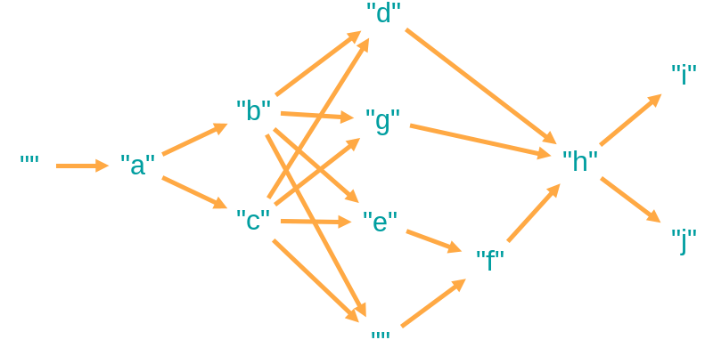
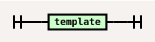
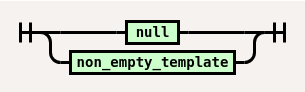
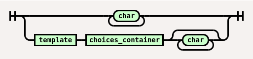
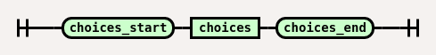
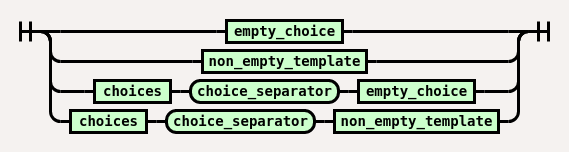
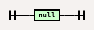

# ambiguity

If you're looking to <|optimize your resume for ATS|generate unique articles for SEO|express what the voices in your head are telling you|>, then you <|need|will love|> **ambiguity**, a templating language for text with multiple <|possibilities|choices|alternatives|>. 

## Usage

First, install the package.

```
npm install github:panasenco/ambiguity
```

Then, use it in your JavaScript code:
```
const ambiguity = require("ambiguity");
const parser = new ambiguity.Parser();
parser.feed("With <|rise of|increase in|> <|productive power|<|economic ||>productivity|>, rent tends to <|rise even higher|even greater increase|>.");
ambiguity_graph = parser.results[0];
console.log(ambiguity_graph.randomString());
```

This will log a random variation of your ambiguity template, for example:

> With increase in productive power, rent tends to even greater increase.

## How it works

Ambiguity compiles your templates into a [graph-structured string](https://en.wikipedia.org/wiki/Graph-structured_stack). The heavy lifting is done by [Nearley](https://nearley.js.org/), [Moo](https://github.com/no-context/moo), and [Graphology](https://graphology.github.io/).

For example, consider the template `a<|b|c|><|d|<|e||>f|g|>h<|i|j|>`. Ambiguity compiles it to the following graph object:



Each path in the graph from the root node to a leaf node represents a string that can be derived from the template.

Ambiguity always creates a blank root node with the ID 'root' that you can begin your traversal from. All other nodes have integer IDs.

## Ambiguity language definition

Token definitions:
- `choices_start`: `<|`
- `choices_end`: `|>`
- `choice_separator`: `|`
- `char`: Any other character.

### main



### template



### non_empty_template



### choices_container



### choices



### empty_choice



